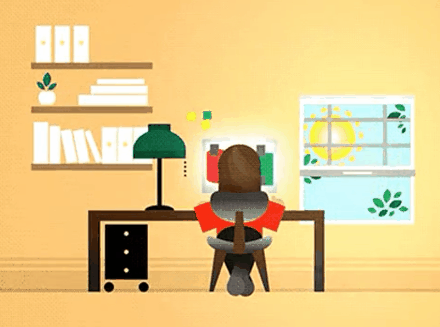

 
 <h1 align="left">Lucca Cintra</h1>
   
  
   

 
 

## Hello, Devs!

Tenho 20 anos, moro em Salvador-BA. Atualmente estou entrando de cabeça no mundo da programação e sentindo mais gosto e satisfação cada vez mais em que eu passo raiva com algum código ou acerto de primeira a lógica de algum problema.

  

### 🖥️ Tecnologias e Ferramentas: 
<code></code>
<code></code>
<code></code>
<code></code>
<code></code>
<code></code>

 
 

 
🔍 Faço parte do ACSO, dentro da equipe @home trabalhando com o robo de serviço <a href="https://www.acso.uneb.br/bill/">BILL</a>

 
📕 Tenho estudado Git, JS e iniciei meus estudos para desenvolver páginas web

 
 
☕ Reforçando o estereótipo, eu amo café, games e faço piadas ruins com certa frequência.

   <a href="https://github.com/LuccinhaCP">
   
   

  

</body>
</html>
